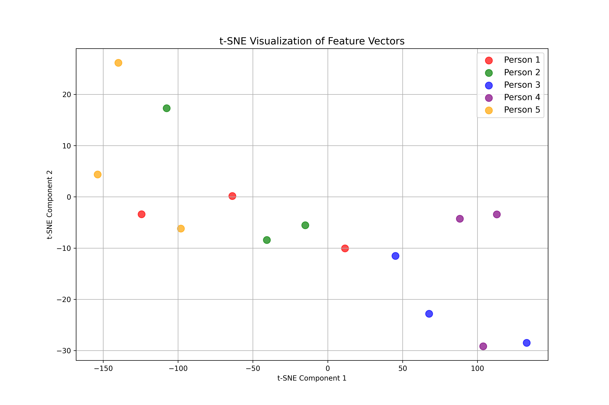

# Advanced CNNs and Siamese Networks for Image Analysis

This project explores two core areas of deep learning for computer vision.
1.  **Part 1** focuses on building and evaluating several advanced Convolutional Neural Network (CNN) architectures for image classification on the CIFAR-10 dataset.
2.  **Part 2** implements a Siamese Network using a pre-trained backbone and a contrastive loss function to perform face verification.

---
## Part 1: CNN Architectures for CIFAR-10 Classification

### Objective
The primary goal of this section was to implement and compare the performance of various CNN building blocks within a standardized base architecture. Each block was designed to test a different concept in modern CNN design, such as attention mechanisms and residual connections.

### Architectures Implemented
Five different architectural blocks were designed and evaluated:
- **Block A:** A foundational block consisting of `Conv -> BatchNorm -> ReLU`.
- **Block B:** Block A augmented with a **Spatial Attention** mechanism (`Conv 1x1 -> Sigmoid`).
- **Block C:** Block A augmented with a **Channel-wise Attention** mechanism (Squeeze-and-Excitation).
- **Block D:** A **Residual Block** that adds the input to the output, inspired by ResNet.
- **Block D (Depthwise):** The residual block implemented with depthwise separable convolutions for computational efficiency.
- **Block E:** A more complex, ResNeXt-inspired bottleneck residual block.

### Results
Each model was trained for 30 epochs. The performance is summarized below.

| Model Block             | Validation Accuracy | Training Accuracy | # of Parameters | Training Time |
| ----------------------- | ------------------- | ----------------- | --------------- | ------------- |
| Block A                 | 88.56%              | 94.162%           | 7,771,434      | 24m 44s      |
| **Block B (Best)** | **89.27%**              | **94.655%**            | **7,773,994**      | **25m 58s**      |
| Block C                 | 88.6%               | 94.550%           | 7,901,130      | 26m 10s      |
| Block D (Residual)      | 87.04%              | 93.59%            | 8,623,402      | 25m 47s      |
| Block D (Depthwise)     | 79.47%              | 81.58%            | 1,827,242      | 23m 45s      |
| Block E (Bottleneck)    | 85.130%             | 87.067%           | 1,422,378      | 25m 49s      |

### Analysis & Conclusion
- **Block B**, which incorporated a simple spatial attention mechanism, achieved the highest validation accuracy. This demonstrates the effectiveness of guiding the model to focus on relevant spatial regions.
- Visual analysis using **t-SNE** plots of the embedding space confirmed the quantitative results. Block B showed better separation between classes compared to other models.
- The most common misclassifications occurred between visually similar classes, such as `automobile` vs. `airplane` and `dog` vs. `horse`. This was consistent across most models.

---
## Part 2: Siamese Network for Face Verification

### Objective
This section aimed to build a similarity learning model for face verification. A Siamese Network was implemented to learn an embedding space where images of the same person are closer together than images of different people.

### Methodology
- **Network:** A Siamese architecture was used, where two identical branches with shared weights process a pair of images. The backbone for each branch was a pre-trained **EfficientNetB0**.
- **Loss Function:** The network was trained using **Contrastive Loss**, which explicitly minimizes the distance for similar pairs and enforces a minimum margin of distance for dissimilar pairs.
- **Hyperparameter Tuning:** **Random Search** was employed to efficiently find the optimal combination of hyperparameters like learning rate, batch size, and output feature dimensions.

### Key Findings

#### 1. Feature Space Separation
The model successfully learned to distinguish between images of the same person and different people. The box plot shows the distribution of Euclidean distances between feature vectors for 1,000 image pairs from the validation set. There is a clear and significant separation between the two distributions, indicating that a simple distance threshold could be used for effective verification.

#### 2. Nearest Neighbor Retrieval
Visual analysis confirmed the model's effectiveness. For randomly selected query images from the test set, the model was able to retrieve other images of the same person as the nearest neighbors in the learned feature space.

#### 3. Impact of Contrastive Loss Margin 
The effect of the margin parameter `m` in the contrastive loss function was investigated.
- With **`m=1.0`**, the model performed well but had some outliers.
- By increasing the margin to **`m=2.0`**, the model was forced to create a more separated embedding space. This resulted in fewer outliers and a tighter clustering of images belonging to the same person, leading to a more robust model.

